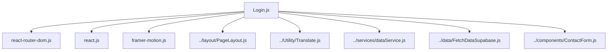

```mermaid
flowchart TD
    Login.js["Login.js"]
    Login.js --> dep0["react-router-dom.js"]
    Login.js --> dep1["react.js"]
    Login.js --> dep2["framer-motion.js"]
    Login.js --> dep3["../layout/PageLayout.js"]
    Login.js --> dep4["../Utility/Translate.js"]
    Login.js --> dep5["../services/dataService.js"]
    Login.js --> dep6["../data/FetchDataSupabase.js"]
    Login.js --> dep7["../components/ContactForm.js"]
```
